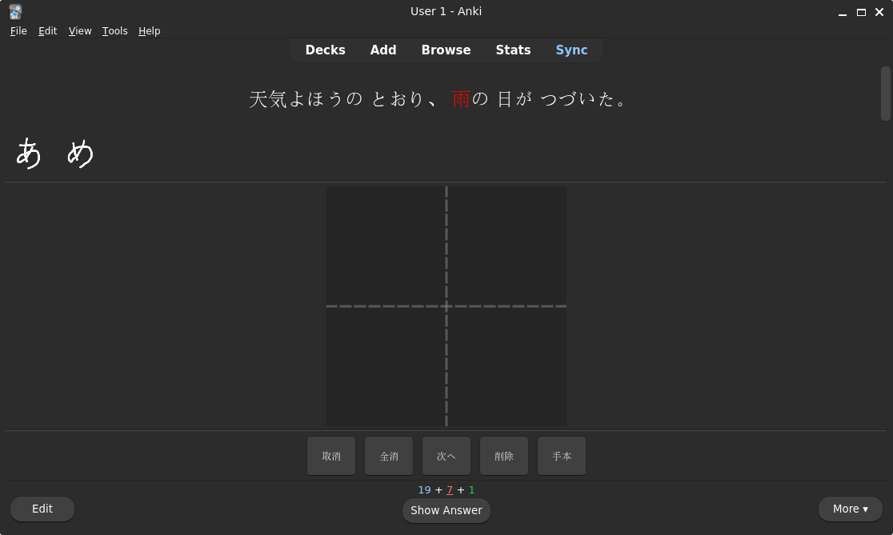
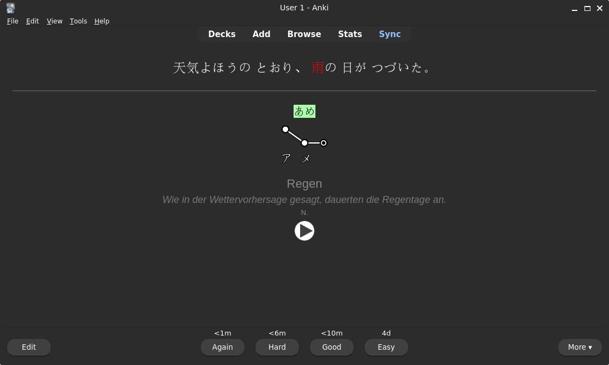

# zinnia-rs

Rust bindings and safe wrapper for the Zinnia handwriting recognition engine.

This crate provides a safe and ergonomic Rust API on top of the original C++ library, with a focus on inference (classification), not training.

## Features

- Safe Rust wrapper (`zinnia`)
- Raw FFI bindings (`zinnia-sys`)
- Python bindings (`zinnia-py`)
- Lazy initialization
- Simple stroke-based API

## Example

Recognizing the character **十** from two strokes:

```rust
use zinnia::{Recognizer, Character};

fn main() -> Result<(), Box<dyn std::error::Error>> {
    let mut recognizer = Recognizer::new();
    recognizer.open("model/handwriting-ja.model")?;

    let mut ch = Character::new();
    ch.set_width(300)?;
    ch.set_height(300)?;

    // horizontal stroke
    ch.add(0, 90, 150)?;
    ch.add(0, 130, 150)?;
    ch.add(0, 170, 150)?;
    ch.add(0, 210, 150)?;

    // vertical stroke
    ch.add(1, 150, 90)?;
    ch.add(1, 150, 130)?;
    ch.add(1, 150, 170)?;
    ch.add(1, 150, 210)?;

    let result = recognizer.classify(&ch, 10)?;

    println!("Top result: {}", result[0].value);
    println!("All candidates: {result:?}");

    Ok(())
}
```

## Anki Addon

`kanji_input` is an Anki addon for practicing kanji writing on cards with a
`{{type:answer}}` field. Instead of typing, you draw each character on a canvas using a mouse or drawing tablet. The addon silently matches your drawing against the expected answer using zinnia recognition.

### Features

- Drawing canvas with grid guide (cross lines)
- 7 character slots showing your drawn ink strokes for the current word
- Hint button (手本) that shows the expected character as a faint watermark
- Undo last stroke (取消), clear canvas (全消), delete last character (削除)
- Automatically submits when "Show Answer" is clicked
- Works with mouse and drawing tablets
- Respects light/dark theme
- Optional Klee One font for the hint character





## Models

This crate does not include pretrained models. You can use models from projects like:

- [tegaki](https://tegaki.github.io/)
- Zinnia-Tomoe

